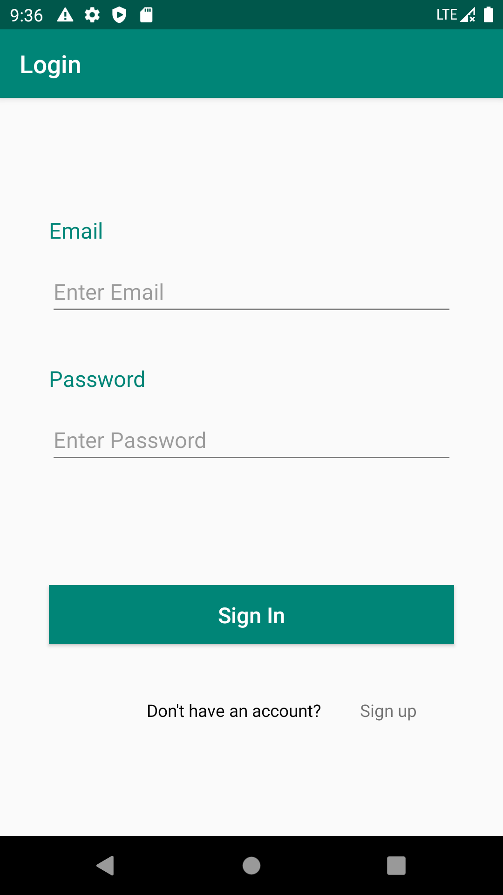
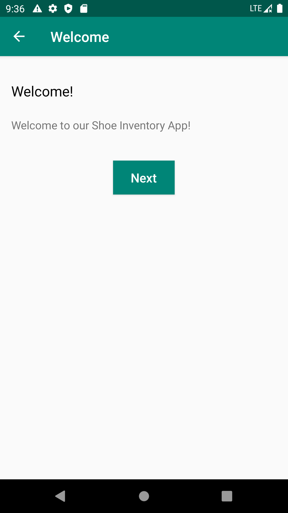
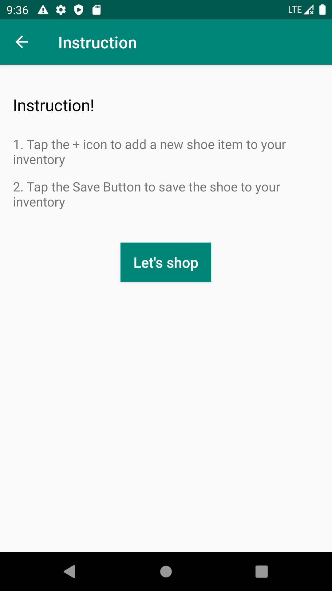
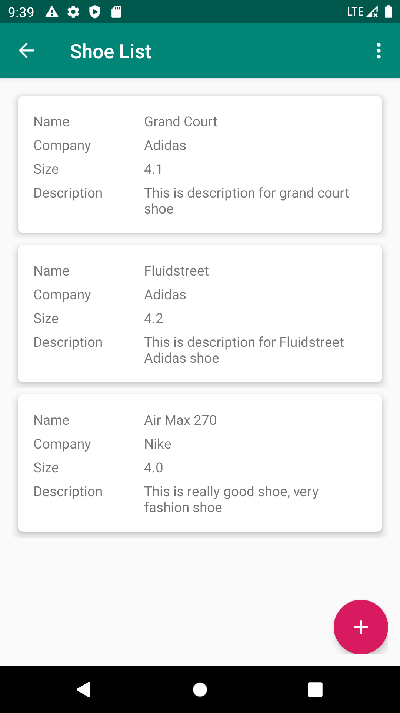
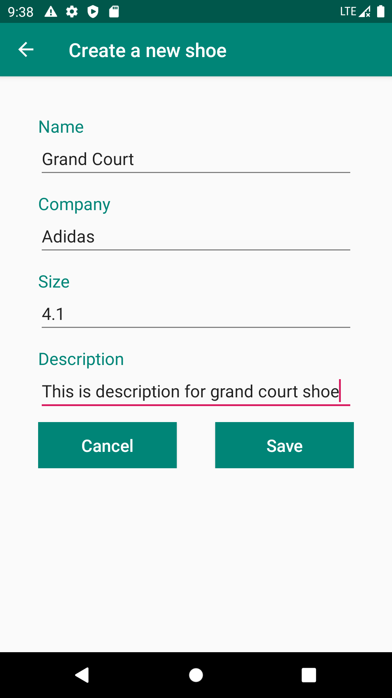
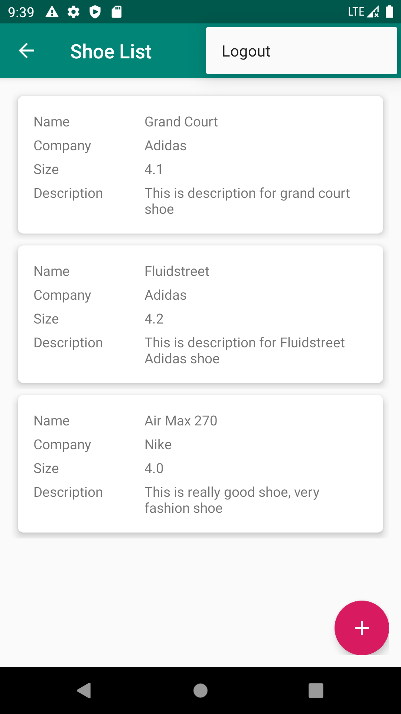

# Shoe Store Inventory App - Udacity nd940
Course link: https://www.udacity.com/course/android-kotlin-developer-nanodegree--nd940

This project will consist of five screens. You don't have to create a shoe store, you can use any other item as long as you create the following screens. You will be creating:

* Login screen: Email and password fields and labels plus create and login buttons
* Welcome onboarding screen
* Instructions onboarding screen
* Shoe Listing screen
* Shoe Detail screen for adding a new shoe

### Skills in this project
* Layout: Constraint Layout & Linear Layout
* Single activity architecture & multiple fragments
* Live Data & ViewModel & SharedViewModel (Shared ViewModel between fragments in the same activity)
* Data Binding
* App Navigation: Safe Args, Transition animations, Setup ActionBar with nav controlelr
* Add Menu Item

# Demo screen
### Login screen

### Welcome screen

### Instruction screen

### Shoe Listing screen

### Shoe Detail screen

### Logout Menu Item

## License
Mai Thanh Hiep & Udacity
